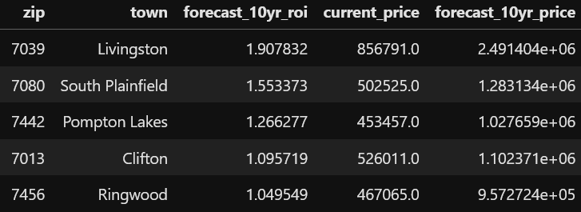

# Top single family home investment opportunities using Zillow data and ARIMA modeling
**Author**: [Nick Timpano](mailto:nick.timpano@gmail.com)

## Overview
In this post, I walk through the process I used to determine the best areas of northern New Jersey in which to potentially purchase single family homes. More specifically, I explore Zillow housing price data to identify the zip codes with best investing potential. This is done by building a number of time series models to forecast which areas could potentially deliver outsized returns over different time horizons.

#### Audience 
Here, I sought to build time series models to predict the future typical house prices for a given area of northern NJ. The results would be most relevant for parties interested in investments in single family residences in this area.  

## Data 
* Zillow ZHVI (Zillow Home Value Index) was used as the measure of home values. ZHVI home value data from January 2000 through July 2022 was used in this project. More information on ZHVI is available here. [here](https://www.zillow.com/research/data/). 
* GeoJSON data was also used to visualize zip code boundaries on a map. The data are available here [here](https://github.com/opendatade). 
* Only data relevant to northern NJ was used. That involved analyzing zip codes in the following counties: 
'Sussex County','Warren County', 'Hunterdon County','Somerset County','Middlesex County','Union County', 'Morris County','Essex County','Hudson County','Bergen County','Passaic County'

## Methods/Techniques 
- Time series modeling was done on the data to forecast future prices for specific zip codes. Specifically ARIMA modeling was conducted using the SARIMAX package.  
- The data were analyzed both at the aggregate Northern NJ level, and for each zip code individually. 

## Results
- In doing a general EDA across all of northern NJ, it was found that typical home values have fluctuated significantly over tinme and in response to world events. It was therefore concluded the data were not stationary.       

- Many of the areas of northern NJ that have grown the most over the past 2 decades are closest to New York City. These were the top 50 zip codes when ranked based off of historical information since 2000:    
 
- The zip codes that were predicted to generate the best long term returns:  


## Conclusions 
Based on the models prodduced and the analysis of data, these were the findings and recommendations: 
- Generally, towns closer to New York City seem to have grown and be predicted to grow the most. They seem like better investment opportunities. 
- Specifically, Livingston was ranked best in both short and long term ROI. However, when looking for houses at or below the average home value, Pompton Lakes and South Plainfield are more recommended. 

## Next Steps 
It could be interesting to add exogenous variables to the model for housing prices. These can be engineered within the data, such as a variable for quarter, or come externally, such as mortgage rates or GDP data. However, in order to forecast ahead of any existing data, those exogenous variables themselves would also need to be forecast as well. If you have a good read on where something correlated with housing prices will be over a longer period of time though, it could be worth factoring that into the model. 
This analysis did not consider factors that would be important to purchase a home for living. It does not consider school systems, crime rate, or other factors that are important for wellbeing. It is purely based on price, and realizing an investment on a single family residence property. 
In future studies, one could group data by town, as opposed to zip codes, since many towns contain several zip codes. 
Prices could be adjusted for inflation, and ROI could be recalculated based on predicted inflation levels. 
This project was done only with northern NJ in mind. There are many other areas of NJ and of course other states entirely with plentiful real estate data.

## More Information 
To see the full EDA please see the [Jupyter Notebook](./zillow_forecasting.ipynb). 

For more information, contact [Nick Timpano](mailto:nick.timpano@gmail.com)

## Repo Structure 

```
├── plots
├── zhvi_sfh_all.csv
├── README.md
└── zillow_forecasting.ipynb
```